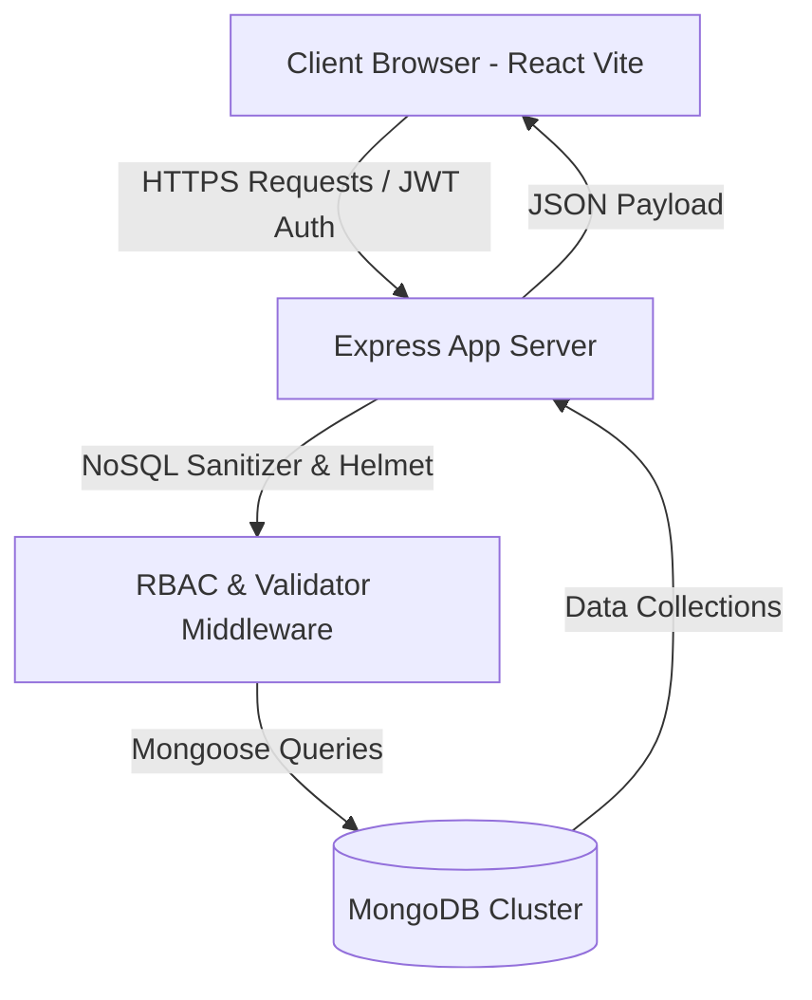
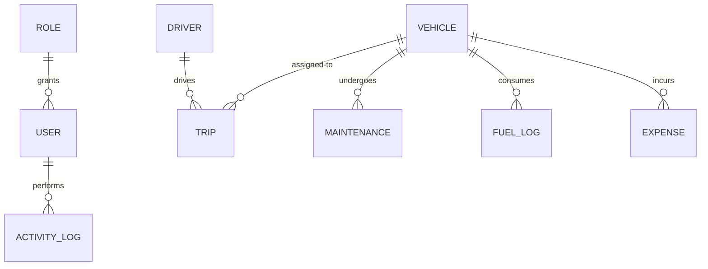

# TransitOps Enterprise

<div align="center">

  

  ### Enterprise-Grade Smart Fleet Management & Telemetry Operations Platform
  *Developed as a scalable, high-performance solution for the Odoo Hackathon 2026*

  [](https://react.dev/)
  [](https://nodejs.org/)
  [](https://expressjs.com/)
  [](https://www.mongodb.com/)
  [](https://jwt.io/)
  [](https://github.com/)
  [](https://opensource.org/licenses/MIT)

</div>

---

### 📝 Project Overview

**TransitOps** is an enterprise-grade transit fleet operations management platform. Built to solve the logistical and financial overheads of mid-to-large-scale logistics businesses, TransitOps delivers real-time telemetry dispatching, dynamic safety leaderboard calculations, strict Role-Based Access Control (RBAC), and automated maintenance and compliance tracking. 

Developed during the **Odoo Hackathon 2026**, this platform was engineered under a strict 8-hour development window to showcase production-grade architecture, seamless backend sanitization, full light/dark theme synchronization, and an interactive simulated GPS control tower that writes directly to a MongoDB database.

---

### 🏆 Key Highlights

- **📡 Live Telemetry & GPS Dispatch Tower:** Run real-time diagnostics on dispatched routes. Inject simulated engine heat, overspeed, or collision force alerts to watch the backend automatically adjust fleet status in MongoDB.
- **🚥 Strict Validation Engine:** Automatic weight-to-capacity verification, license expiry prevention, and sequential odometer locking to ensure data integrity.
- **👥 Enterprise Role-Based Access Control (RBAC):** Hierarchical permissions dividing views and actions among Admins, Fleet Managers, Drivers, Safety Officers, and Financial Analysts.
- **📈 Real-Time Operations HUD:** Dashboard containing active SVG tracking paths, dynamic safety score meters, and responsive grid configurations.
- **🌓 Dynamic Theme Sync:** Modern UI featuring fluid transitions, custom slim scrolls, glassmorphic panels, and theme mutation observers to redraw ChartJS grids on class changes.

---

### 📺 Live Demo & Deployment

*   **Backend API (Render):** [TransitOps Backend Link](https://transitops-hackathon-2026.onrender.com/)

| Light Dashboard | Dark Telemetry Console |
| :---: | :---: |
|  |  |

---

### 📐 System Architecture



#### Architecture Breakdown
*   **Frontend (SPA):** Built using React 18 and Vite. Implements a responsive viewport system, global context providers for authentication and notifications, custom Axios interceptors to auto-attach authorization tokens, and ChartJS widgets.
*   **Backend (REST API):** Express server built on Node.js. It features security middleware (`helmet`, `cors`, `mongoSanitize`), rate limiters to mitigate DDoS attacks, validation schemas (`zod`), and a modular route-controller-service layout.
*   **Database (Mongoose):** Highly normalized document relationships inside MongoDB, leveraging compound indices, automatic model transforms, and pre-save validators to protect transactional records.

---

### 📂 Folder Structure

```text
TransitOps-Hackathon-2026/
├── client/                     # React Vite Frontend Application
│   ├── src/
│   │   ├── components/         # Reusable layouts, widgets, modals, confirm dialogs
│   │   ├── contexts/           # Authentication state, global in-app notifications
│   │   ├── layouts/            # Auth and App view wrappers
│   │   ├── pages/              # Features (dashboard, vehicles, drivers, trips, settings, logs)
│   │   ├── routes/             # Protected routes and role-based redirect filters
│   │   ├── services/           # Axios network endpoints to backend API
│   │   ├── utils/              # Formatting, badge styling, constants
│   │   ├── index.css           # Core styling tokens, scrolling rules, gradients
│   │   └── main.jsx
│   ├── tailwind.config.js      # Animations, shadows, and glass tokens
│   └── vite.config.js
└── server/                     # Express Node.js Backend Application
    ├── src/
    │   ├── config/             # DB configuration, JWT keys, Constants
    │   ├── controllers/        # REST Route handlers
    │   ├── middleware/         # RBAC, Rate-limiters, Validations, Errors
    │   ├── models/             # Mongoose schemas (Vehicle, Driver, Trip, etc.)
    │   ├── routes/             # Route mapping (index.js, user.routes.js, etc.)
    │   ├── services/           # DB query transactional business logic
    │   ├── utils/              # Standard responses, Logger
    │   └── validators/         # Zod schemas for input validation
    └── package.json
```

---

### 🛠️ Tech Stack

*   **Frontend:** React 18, Vite, TailwindCSS, Chart.js, React ChartJS 2, Lucide React, Axios, React Hook Form, Zod.
*   **Backend:** Node.js, Express, Mongoose, JWT (JSON Web Tokens), BCrypt, Helmet, CORS, Express Mongo Sanitize, Winston Logger.
*   **Database:** MongoDB.
*   **Development Tools:** Git, Postman, Mermaid Diagrams.

---

### 📋 Features & Status

| Module | Sub-Features / Implementations | Status |
| :--- | :--- | :---: |
| **Authentication** | JWT tokens, sliding session refresh, client interceptors | `Completed` |
| **Dashboard** | Dynamic KPIs, driver safety podiums, animated dispatch simulator | `Completed` |
| **Vehicles** | Grid/List views, capacity load bars, status monitors | `Completed` |
| **Drivers** | Compliance warnings, active license checks, safety rankings | `Completed` |
| **Trips** | Multi-step dispatch forms, timeline roadmaps, dispatcher | `Completed` |
| **Telemetry HUD** | Real-time speeds, G-force impact triggers, remote DB updates | `Completed` |
| **Maintenance** | Open/Closed logs, scheduling forms, estimated costs | `Completed` |
| **Fuel & Expense** | Liters count, automated average costs, categories selector | `Completed` |
| **Reports** | Cost breakdowns, utilization, exports (CSV files) | `Completed` |
| **Audit Logs** | Change logs, before/after values, diff indicators | `Completed` |
| **Security** | NoSQL query injection sanitizers, rate limiters, passwords hash | `Completed` |
| **Offline Sync** | Service Worker background caching | `In Progress` |

---

### 💼 Core Business Rules

To reflect realistic ERP operations, the codebase implements strict transactional business logic:

1.  **Odometer Continuity Rule:** When logging a fuel log or completing a trip, the new odometer reading *must* be greater than the vehicle's current odometer. Additionally, during trip completion, the final odometer must cover at least the planned distance.
2.  **Capacity Constraint Safeguard:** The dispatch system checks the selected vehicle's `maxLoadCapacityKg`. If the trip's cargo weight exceeds this value, dispatch is blocked.
3.  **Driver License Expiry Rule:** Drivers with an expired license date (`licenseExpiryDate < now`) are locked out of dispatches.
4.  **Operational Exclusivity:** A vehicle or driver status can only transition to `On Trip` if they are currently marked as `Available`. Once dispatched, their status locks.
5.  **Collision Event Automatic Take-Down:** In the event of a simulated crash telemetry signal, the backend automatically cancels the active trip (logging the crash reason) and updates the vehicle status to `In Shop`.

---

### 📊 Database Schema Design

The relationship mapping is established via reference fields in Mongoose:



#### Collection Definitions
*   **Vehicles (`Vehicle`):** Stores registration numbers, acquisition costs, odometer logs, and statuses.
*   **Drivers (`Driver`):** Tracks names, license levels (LMV, HMV, etc.), expiry dates, duty flags, and safety indices.
*   **Trips (`Trip`):** Links source, destination, cargo weight, revenue, status, distances, driver, and vehicle references.
*   **Maintenance (`Maintenance`):** Logs scheduled services, expected/actual end dates, statuses, and costs.
*   **FuelLogs (`FuelLog`):** Logs liters, price/liter, total cost, and mileage metrics.
*   **Expenses (`Expense`):** Logs operational costs like tolls, fines, insurance, and parking.
*   **Notifications (`Notification`):** Manages user notifications, read states, types, and priorities.

---

### 🔌 REST API Documentation

All routes require JWT authorization and are prefixed with `/api/v1`.

| Method | Endpoint | Description | Permitted Roles |
| :--- | :--- | :--- | :--- |
| `POST` | `/auth/login` | Authenticate user, return token | Public |
| `GET` | `/dashboard/kpis` | Fetch operation dashboard counts | All Roles |
| `GET` | `/vehicles` | List vehicles (supports filters) | All Roles |
| `POST` | `/vehicles` | Add a new vehicle to fleet | Admin, FleetManager |
| `GET` | `/drivers` | Retrieve compliance safety list | All Roles |
| `POST` | `/trips` | Save a new trip as Draft | Admin, FleetManager |
| `PATCH`| `/trips/:id/dispatch`| Dispatch driver & vehicle | Admin, FleetManager |
| `PATCH`| `/trips/:id/complete`| Conclude trip, record mileage | Admin, FleetManager |
| `POST` | `/trips/:id/telemetry`| Log simulated vehicle alerts | Admin, FleetManager |
| `GET` | `/maintenance` | List open/closed shop records | All Roles |
| `POST` | `/maintenance` | Schedule vehicle repair order | Admin, FleetManager |
| `GET` | `/reports` | Fetch utilization/cost logs | Admin, FinancialAnalyst|
| `GET` | `/activity-logs` | Retrieve detailed audit trail | Admin, FleetManager |

---

### 🚀 Installation & Local Setup

#### Prerequisites
- Node.js (v18+)
- MongoDB Community Server (Running on `localhost:27017` or MongoDB Atlas URI)

#### 1. Clone the Repository
```bash
git clone https://github.com/your-username/TransitOps-Hackathon-2026.git
cd TransitOps-Hackathon-2026
```

#### 2. Configure Environment Variables
Create a `.env` file in the `server` folder:
```env
PORT=5000
MONGO_URI=mongodb://127.0.0.1:27017/transitops
JWT_SECRET=super_secret_access_key_12345
JWT_REFRESH_SECRET=super_secret_refresh_key_54321
JWT_EXPIRY=24h
JWT_REFRESH_EXPIRY=7d
CORS_ORIGIN=http://localhost:5173
```

#### 3. Seed Database
Seeding loads default roles, permissions, administrative users, and starting vehicles/drivers:
```bash
cd server
npm install
npm run seed
```

#### 4. Run the Backend Server
```bash
npm start
# Server starts on http://localhost:5000
```

#### 5. Run the Frontend Client
Open a new terminal window:
```bash
cd client
npm install
npm run dev
# App launches on http://localhost:5173
```

---

### 🔒 Security Implementations

*   **NoSQL Injection Defense:** Evaluates incoming request query objects and sanitizes SQL/NoSQL command characters.
*   **DDoS rate-limit filters:** Restricts rapid endpoint calls from single IPs, configured via standard express packages.
*   **Helmet Headers:** Enforces security headers (HSTS, CSP, XSS-Protection).
*   **Password Hashing:** Hashes passwords with salt factors (using BCrypt).
*   **JWT Exclusivity:** Verifies tokens on HTTP headers and redirects unauthorized routing attempts.

---

### ⚡ Performance Optimizations

*   **Theme Observers:** Restricts ChartJS redraw commands by listening specifically to the `class` mutations on the `html` tag rather than continuous polling.
*   **Component-based CSS transitions:** Offloads heavy paint animations (like hover scales and card rotations) to GPU hardware acceleration.
*   **Database Indices:** Compound indexing is configured on state query fields like `Vehicle (status, type)` and `Trip (status, vehicleId, driverId)` to ensure fast read access.

---

### 🔮 Future Scope

*   **Dynamic Route Optimization:** Integrating Mapbox APIs to compute optimized multicity transit routes, factoring in toll fees and traffic patterns.
*   **Offline Data Queues:** Registering service worker synchronization protocols to queue vehicle telemetry updates in offline zones and push once connection returns.
*   **IoT OBD-II Integration:** Connecting actual OBD hardware controllers to parse real vehicle temperature and trouble codes directly.

---

## 👥 Contributors

Developed collaboratively during the **Odoo Hackathon 2026**.

| Contributor | GitHub Profile |
|-------------|----------------|
| **Anvesh Anumolu** | [](https://github.com/Anvesh-999) |
| **Atyam S V Teja** | [](https://github.com/teja16asv) |
| **Harigopichand Ponnekanti** | [](https://github.com/harigopichandponnekanti) |
| **Ajay Gopagoni** | [](https://github.com/gopagoniajay) |

> **Collaboration:** This project was built collaboratively during the **Odoo Hackathon 2026**, with all team members contributing across frontend development, backend development, integration, testing, debugging, and documentation.
---

### 🏆 Hackathon
*   **Event:** Odoo Hackathon 2026
*   **Development Duration:** 8 Hours
*   **Team Size:** 4 Developers
*   **Goal:** Build a production-ready enterprise fleet logistics platform with live telemetry monitoring.

---

### 📄 License

Distributed under the MIT License. See [LICENSE](LICENSE) for more details.

---

### 🤝 Acknowledgements

*   [Lucide Icons](https://lucide.dev)
*   [Chart.js](https://www.chartjs.org/)
*   [Tailwind CSS](https://tailwindcss.com)
